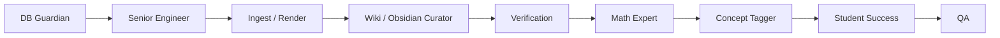

# 🎖️ 에이전트 지휘본부

> 총괄 마스터: Codex Captain  
> 운영 원칙: 원본문제·원본해설 불변 → DB 생존성 → 인제스트/크롭 → Obsidian 정합성 → 검수 → 개념 태깅 → 학생 맞춤

---

## 1. 지휘 체계

| 계층 | 에이전트 | 책임 | 보고 |
|---|---|---|---|
| 총괄 | Captain | 전체 우선순위, 실행 순서, 보고서 | 사용자 |
| 원본보호 | Integrity Guard | 원본문제·원본정답·원본해설 해시 감시 | Captain |
| 안전 | DB Guardian | DB 0바이트 방지, 최신 스냅샷 복구 | Captain |
| 기술 | Senior Engineer | 코드·DB·보안·성능·회귀 점검 | Captain |
| 수집 | Ingest | 새 PDF 탐지, 등록 후보 관리 | Senior Engineer |
| 이미지 | Render | crop 이미지 품질·누락 점검 | Senior Engineer |
| 위키 | Wiki | DB와 문제 노트 수 정합성 | Senior Engineer |
| Obsidian | Obsidian Curator | frontmatter·검수 필드·대시보드 관리 | Senior Engineer |
| 검색 | Search | 유사문제·그룹·검색 준비 상태 | Senior Engineer |
| 검수 | Verification | stage1/2/3, A/B등급, 서명 진행률 | Captain |
| 수학 | Math Expert | 정답 검증, 풀이, 개념 분류 | Captain |
| 개념 | Concept Tagger | concept_tags 우선순위와 concepts 연결 | Captain |
| 수업 | Teacher | 수업계획·숙제·슬라이드 | Captain |
| 학생 | Student / Student Success | 풀이 시뮬레이션·오답·맞춤 추천 | Teacher |
| 품질 | QA | 전체 에이전트 smoke test | Senior Engineer |

---

## 2. 현재 최우선 과제

1. Integrity Guard: 원본문제·원본정답·원본해설 변형 여부 매 작업 전 확인
2. DB Guardian: `db/problems.db`가 276문제 운영 DB인지 매 작업 전 확인
3. Obsidian Curator: 모든 문제 노트에 검수 필드 유지
4. Math Expert: stage3 해설 입력 루프 시작. 단, 기존/공식 해설은 보존하고 추가 해설만 별도 기록
5. Concept Tagger: 수업용 세부 태그 2차 보정
6. Student Success: 진우 진단 세트와 학생 페이지 구축

---

## 3. 표준 실행 명령

```powershell
python agents\integrity_guard_agent.py --audit
python agents\db_guardian_agent.py --status
python agents\senior_engineer.py --check all
python agents\obsidian_curator_agent.py --audit
python agents\verification_agent.py --status
python agents\concept_tagging_agent.py --plan
python agents\student_success_agent.py --readiness
python agents\qa_agent.py --smoke
```

---

## 4. 주간 운영 순서



---

## 5. 의사결정 규칙

- DB가 0바이트거나 `problems` 테이블이 없으면 어떤 작업보다 복구가 먼저다.
- 원본문제와 원본해설은 절대 수정하지 않는다. 해시 변경 감지 시 모든 후속 작업을 중단한다.
- 공식/기존 해설은 보전한다. 다른 형태의 해설은 `추가 해설`로만 별도 생성한다.
- Obsidian에서 검수한 필드는 DB 동기화 때 절대 초기화하지 않는다.
- A등급은 이미지 pass, 정답 pass/fixed, 해설 pass, 선생님/관리자 서명까지 끝난 문제만 준다.
- 개념 태그는 문제마다 2~5개로 제한하고, 가능한 한 `wiki/concepts/` 노트와 연결한다.
- 학생 맞춤 추천은 최소한 정답·개념 태그·오답 이력이 있을 때 시작한다.
