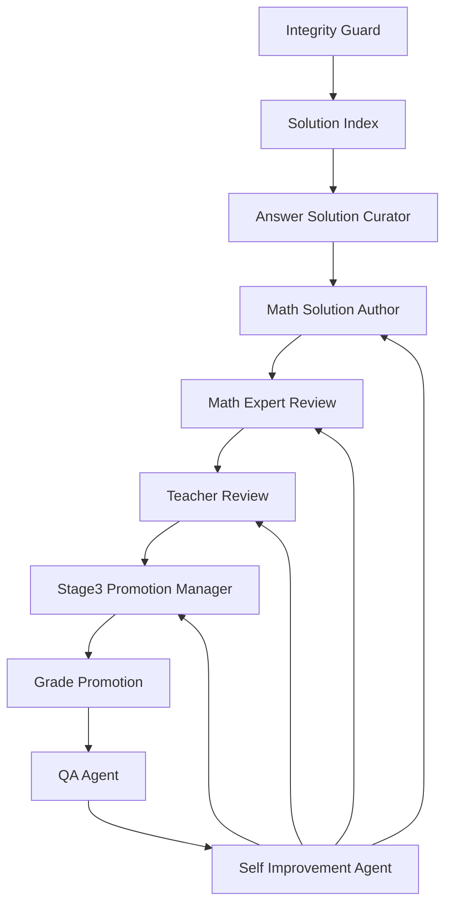

# 에이전트 자체 발전 구조

## 목적

이 구조는 프로젝트가 단순히 문제를 저장하는 수준을 넘어, 원본 보존 원칙을 지키면서 스스로 병목을 찾고 다음 작업을 정렬하도록 만든다.

## 절대 원칙

- 원본문제, 원본정답, 원본해설은 수정하지 않는다.
- 공식 해설과 추가 해설은 같은 필드에 섞지 않는다.
- 검산하지 않은 항목을 `pass`로 표시하지 않는다.
- Teacher 검수는 Math Expert 검산 이후에만 진행한다.
- stage3 승격은 검산, 검수, 원본 무결성, 색인이 모두 통과한 뒤에만 가능하다.

## 에이전트 흐름

## 신규 에이전트 역할

### Math Expert Review Agent

- 파일: `agents/math_expert_agent.py`
- 보고서: `wiki/00_MATH_EXPERT_REVIEW_QUEUE.md`
- 역할: 추가 해설 초안의 수학적 정확성 검산 대기열을 만든다.
- 현재 상태: 276개 모두 검산 보류.
- 주요 보류 사유: 추가 해설이 아직 템플릿/미완성 상태, Math Expert 검산 미완료.

### Teacher Review Agent

- 파일: `agents/teacher_agent.py`
- 보고서: `wiki/00_TEACHER_REVIEW_QUEUE.md`
- 역할: Math Expert 검산 통과분만 수업 표현, 오개념 예방, 학생 이해도 기준으로 검수한다.
- 현재 상태: Teacher 검수 가능 0개, 검수 보류 276개.
- 주요 보류 사유: Math Expert 검산 선행 필요.

### Self Improvement Agent

- 파일: `agents/self_improvement_agent.py`
- 보고서: `wiki/00_SELF_IMPROVEMENT_SYSTEM.md`
- 역할: QA, 원본 무결성, 색인, 검산, 검수, stage3, A등급 결과를 모아 다음 우선순위를 산출한다.
- 현재 상위 위험: stage3 후보 0개, A등급 후보 0개, untracked 파일 과다.

## 자기 발전 루프

1. 원본 무결성을 감사한다.
2. 모든 문제 노트의 원본/추가 해설 색인을 확인한다.
3. 추가 해설 초안이 작성되었는지 확인한다.
4. Math Expert가 실제 검산 가능한 초안과 미완성 템플릿을 분리한다.
5. Teacher가 검산 통과분만 수업 표현 검수 대상으로 받는다.
6. Stage3 Promotion Manager가 검산/검수 통과분만 승격 후보로 분리한다.
7. Grade Promotion Agent가 Teacher/Captain 서명까지 확인한다.
8. Self Improvement Agent가 병목과 다음 우선순위를 갱신한다.

## 현재 다음 작업

1. 추가 해설 초안 중 우선 10개를 실제 풀이 초안으로 완성한다.
2. Math Expert 검산 후보 10개를 만든다.
3. Teacher 검수 후보를 만든다.
4. stage3 승격 후보가 0개에서 증가하는지 확인한다.
5. local git untracked 파일을 보존, 추적, 무시 대상으로 분류한다.
